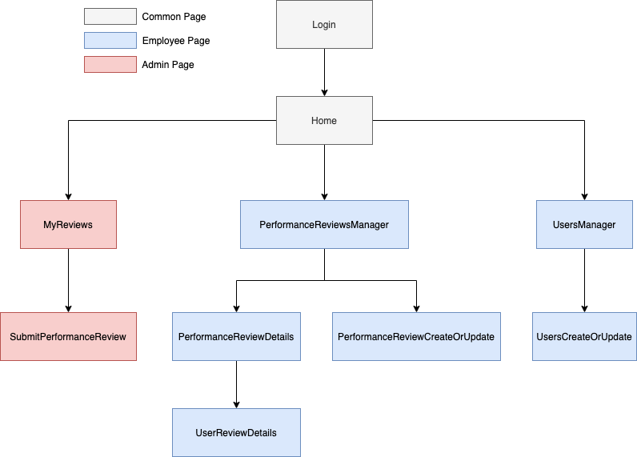
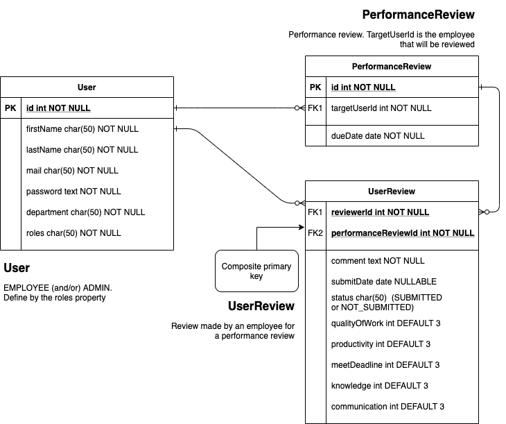
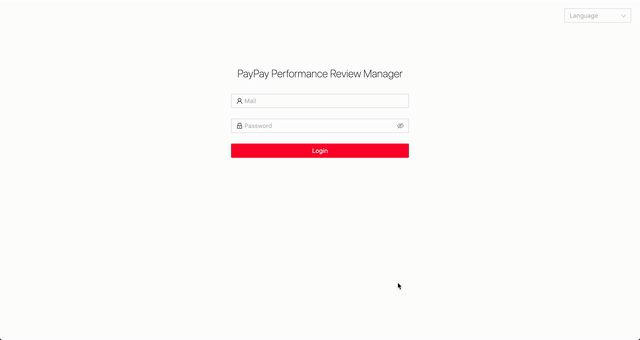
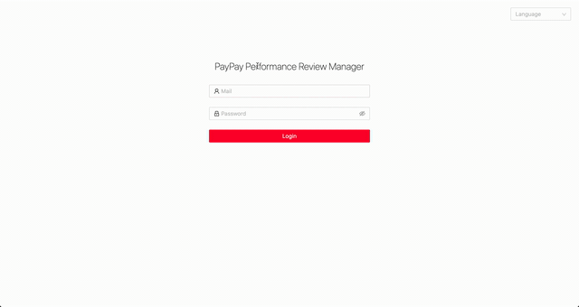
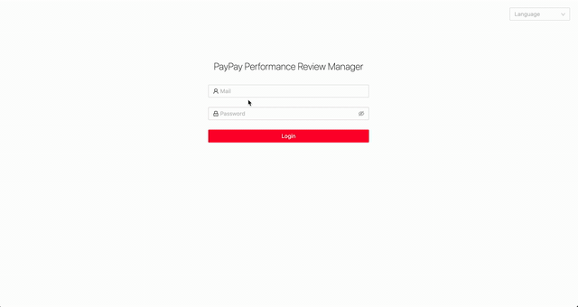
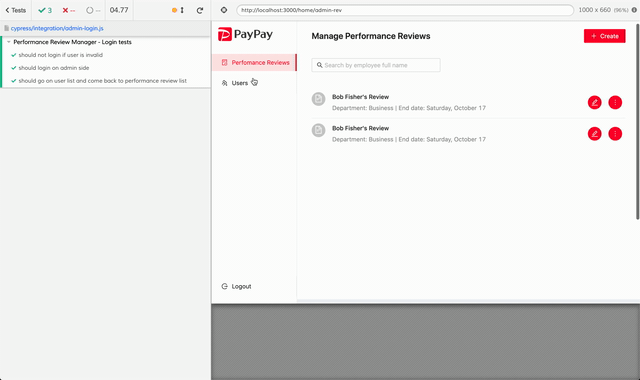

# Pay Pay Full Stack Engineer Challenge

## Default Administrator (ADMIN VIEW)

| Admin | Password |
| ----- | -------- |
| admin | admin    |

Please use this user to create users (employee or admin) and performance reviews

## Run the application

Requirements:

- NodeJS LTS 12.18.\*
- yarn (or npm)

### Back-end

```bash
$ node -v # should be 12.18
$ cd ./back
$ yarn install
$ yarn start

# little tests
$ npm run test:full
```

### Back-end API description

A swagger documentation is available at `http://localhost:2020/v1/api/swagger/#/`. To fully try out the API, you need to login through the `/v1/api/auth/login` endpoint (using the credentials below) and past the `access_token` in the `Authorize` section (button on the top right).

### Front-end

```bash
$ node -v # should be 12.18
$ cd ./front
$ yarn install
$ yarn start

## test (needs back-end)
$ yarn cypress:test # without cypress UI
$ yarn ./node_modules/.bin/cypress open # with cypress UI
```

## Assumptions, high level description of design & Librairies

### Assumptions

- ADMIN & EMPLOYEE are considering as roles in the app
- A user could be both an administrator of the application and an employee (select both roles in the `user creation` view).
  > The employee and admin views are therefore combined into one with with an adaptive menu. It is possible to change this specification and separate the two views. Real world case: the admin could be a Human Ressource Manager / Team Manager. He can manage the employee list and the performance reviews list but may wants to review the employees as well.
- Multiple performance reviews can be created for one employee (Ex: one performance review every year)
- Deleting a user delete his performance reviews and reviews made in other performance reviews
- In a performance review, removing an employee from the reviewers list delete his review as well

### Front-End Pages



### Entities



## Main Libraries

### Front-End

| Library Name                                 | Quick description                                                  |
| -------------------------------------------- | ------------------------------------------------------------------ |
| ReactJS                                      | UI Library                                                         |
| [AntDesign](https://ant.design/)             | UI Components framework                                            |
| Redux                                        | To manage the state of the application                             |
| react-i18next                                | App multiple-language support                                      |
| reach-router                                 | Routing library for react                                          |
| react-infinite-scroller                      | Used for lazy loading on the Performance Reviews page (Admin view) |
| react-testing-library                        | Testing library                                                    |
| Axios                                        | http request library                                               |
| [Cypress](https://www.cypress.io/dashboard/) | Black Box UI tests framework                                       |

### Back-End

| Library Name                       | Quick description                                                 |
| ---------------------------------- | ----------------------------------------------------------------- |
| [NestJS](https://docs.nestjs.com/) | Node.js server-side applications framework                        |
| Sqlite / ORM: TypeORM              | Database (to make the app installation easier for this challenge) |
| bcrypt                             | For password hashing                                              |
| passport & passport-jwt            | For managing Authentication on the API                            |
| class-validator                    | Auto validation for incoming request including a body object      |

### Improvment

This application was produced in a short time frame. Some compromises had to be made. If the application had to evolved, here's what could be done to improve it:

- Increase the test coverage of both back-end and front-end. Due to time restriction only few tests has been made, Black Box UI tests & one test file on back-end side. In a real world project, every use case of the application should be tested.
- Insead of using plain text api routes ([example](./front/src/api/authentication.ts#20)), all the route should be move to a config file or a metadata call on the API side
- Use express rate limit for registering new user to avoid performance issue. Indeed, every password is hashed using `bcrypt` and it takes ressources on the server side every time an admin create a user
- Reload the app logout the user. Should implment a `refresh_token` with the current `access_token` to avoid this. [more deails here](https://tools.ietf.org/html/rfc6749#section-1.5)
- The app currently use cookie to authenticate the user. However the security could be improved, especially to avoid `Cross-site request forgery attack` by using a `CSRF Token `https://portswigger.net/web-security/csrf/tokens
- This application is intended to be used internally within a company. It may be relevant to shift the responsibility of the authentication and authorization part to an Identity Provider / Identity Manager / Authorization server. Such kind of service can support multiple authentication protocol and can integrate with existing enterprise applications. Example: [Identity Server](https://identityserver.io/)

## Demo

### Admin Side - Add user / Performance review creation



### Employee Side - Submit Performance review



### Admin Side - View performance review detail



### Black Box UI Tests using cypress - Login And Menu navigation tests


